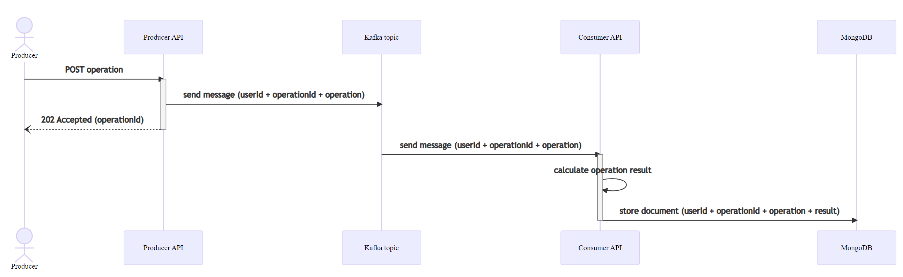
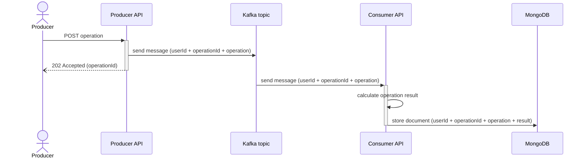
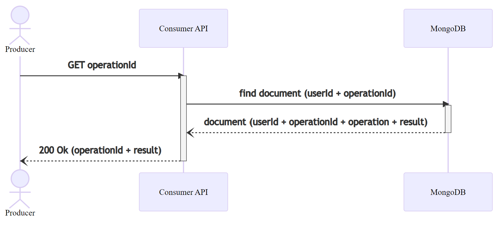
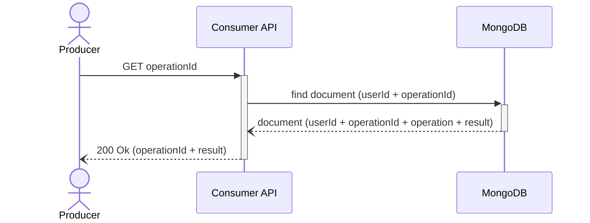
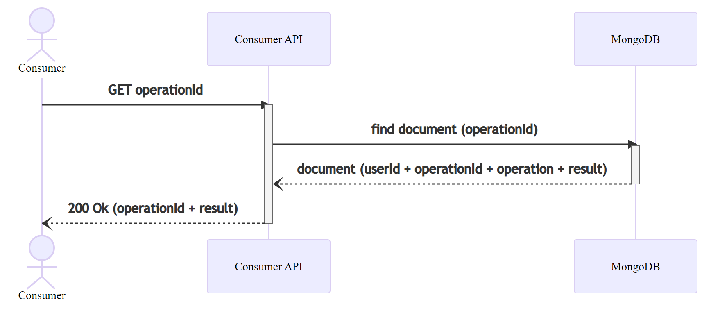
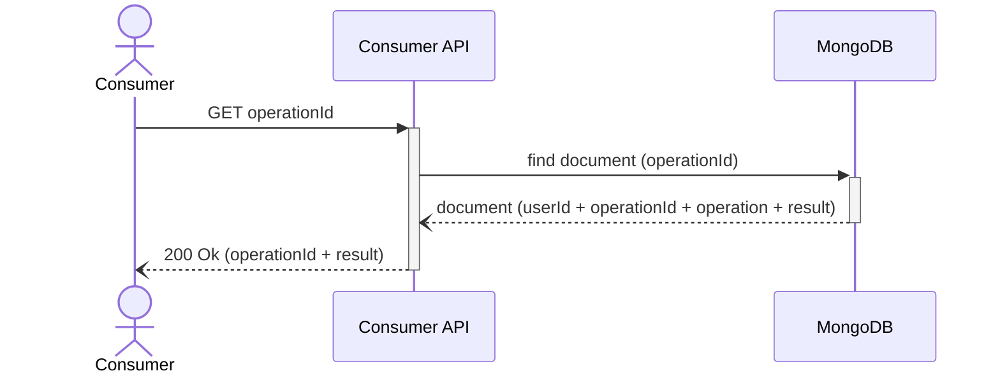

# Introduction

This code repository contains an example that shows how you can use several Azure services from APIs developed with
Java and [Quarkus](https://quarkus.io/), the Supersonic Subatomic Java Framework.

These Azure services are:

- [Azure Active Directory (AAD) B2B](https://docs.microsoft.com/en-us/azure/active-directory/external-identities/what-is-b2b)
  for external identity management and authentication.
- [Azure Event Hubs for Kafka](https://docs.microsoft.com/en-us/azure/event-hubs/event-hubs-for-kafka-ecosystem-overview)
  for asynchronous communication between APIs.
- [Azure CosmosDB with MongoDB API](https://docs.microsoft.com/en-us/azure/cosmos-db/mongodb/mongodb-introduction)
  as the NoSQL database.
- [Azure Application Insights](https://docs.microsoft.com/en-us/azure/azure-monitor/app/app-insights-overview)
  for Application Performance Management (APM) and monitoring.

## Getting Started

### What is included in the example

The example includes the following:

- [src](src/README.md): the source code of the APIs.
- [postman](postman/README.md): Postman collection and sample environment that you can use to test the APIs.

### Pre-requisites

- Install the [recommended tools](docs/recommended-tools.md).
- Setup [required services](docs/setup-services.md).

### Build, Run and Test

- Follow the instructions in [src](src/README.md) and its subfolders to build and run the APIs.
- Use provided [Postman collection](postman/README.md) to test the APIs.

## Details

### Personas

- `Producers` can send operations to the system.
  They can also retrieve the results of the operations that they sent to the system.
- `Consumers` can retrieve the results of any operation sent by any Producer.
  They cannot send any operation to the system.

### Sequence Diagrams

Producer sends an operation:

<!--

-->

Producer retrieves a result of one of her operations:

<!--

-->

Consumer retrieves a result for any operation:

<!--

-->
